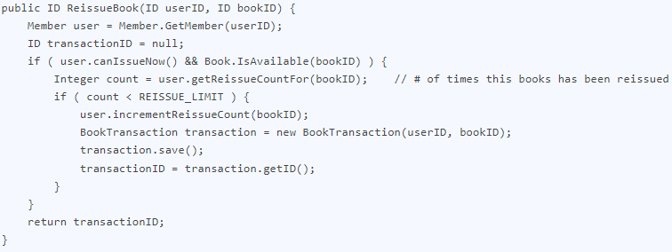
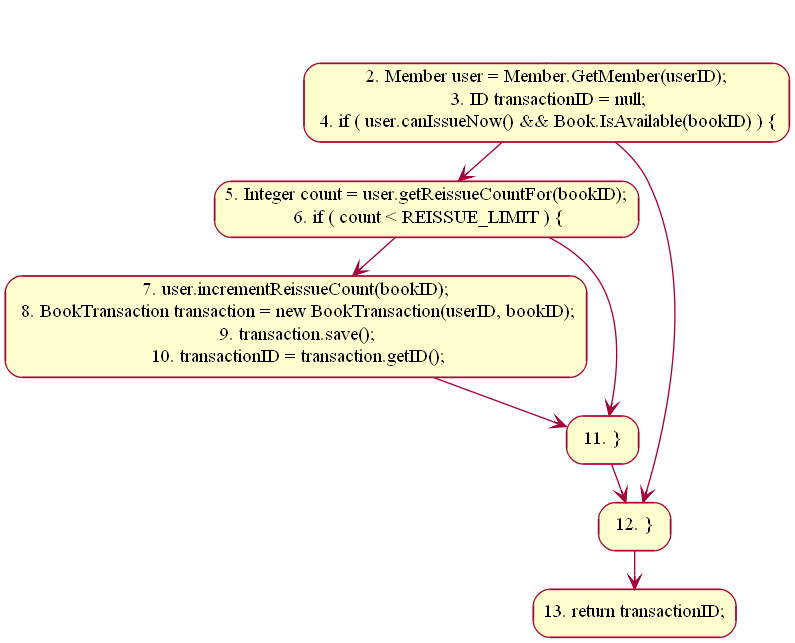
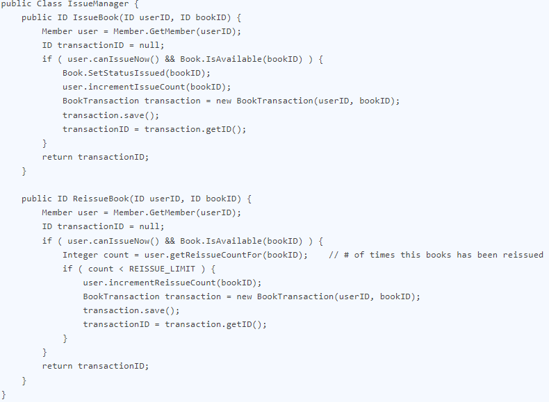

## Case Study

**A Library Information System for SE VLabs Institute**

The SE VLabs Institute has been recently setup to provide state-of-the-art research facilities in the field of Software Engineering. Apart from research scholars (students) and professors, it also includes quite a large number of employees who work on different projects undertaken by the institution.

As the size and capacity of the institute is increasing with the time, it has been proposed to develop a Library Information System (LIS) for the benefit of students and employees of the institute. LIS will enable the members to borrow a book (or return it) with ease while sitting at his desk/chamber. The system also enables a member to extend the date of his borrowing if no other booking for that particular book has been made. For the library staff, this system aids them to easily handle day-to-day book transactions. The librarian, who has administrative privileges and complete control over the system, can enter a new record into the system when a new book has been purchased, or remove a record in case any book is taken off the shelf. Any non-member is free to use this system to browse/search books online. However, issuing or returning books is restricted to valid users (members) of LIS only.

The final deliverable would a web application, which should run only within the institute LAN. Although this reduces security risk of the software to a large extent, care should be taken no confidential information (eg., passwords) is stored in plain text.

Let us determine the Cyclomatic complexity for the "ReissueBook" method as shown below:

 Figure-01

The Control Flow Graph for the above module is shown in figure 1. The CFG has six nodes and seven edges. So, the Cyclomatic complexity is V(G) = 7 - 6 + 2 = 3. It can be verified with the other two formulae as well: # of regions + 1 = 2 + 1 = 3. Also, # of decision points = 2. So, V(G) = 2 + 1 = 3. However, as mentioned in the theory section, for methods of classes we add an extra 1 to the V(G). So, the Cyclomatic complexity of this method becomes 4, which is good.

 Figure-02: CFG for "ReissueBook" method

Note that in line # 3 two decisions have been short-circuited. Taking this into account, V(G) for the module would become 5, which is OK. This implies that the method could have upto five linearly independent paths. By looking at figure 1 we can easily identify three such paths. However, as mentioned that line # 3 consists of two decision points, that results in another "implicit" path. Based on these, we can design four test cases that would result in Boolean values for this sequence { user.canIssueNow, Book.IsAvailable, count < REISSUE_LIMIT }. The four such cases are shown below:

- { true, true, true } : Output should be a valid ID
- { false, true, true } : Output would be null
- { true, false, true } : Output would be null
- { true, true, false } : Output would be null

Now let us focus on the "IssueManager" class. For simplicity, let's assume it has only two methods: IssueBook and ReissueBook, as shown below.

 Figure-03

"IssueBook" has two decision points (if and &&). So, V(GIssueBook) = (2 + 1) + 1 = 4. We have already determined V(GReissueBook) to be 5. So, the total Cyclomatic complexity of this class (having two methods) becomes
V(G) = (4 + 5) - 2 + 1 = 8