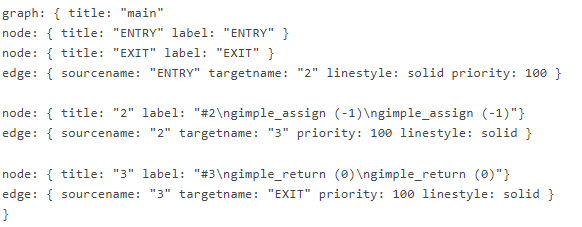

## Procedure

Steps for conducting the experiment

#### **General Instructions**

Follow are the steps to be followed in general to perform the experiments in **Software Engineering Virtual Lab.**

1. Read the theory about the experiment
2. View the simulation provided for a chosen, related problem
3. Take the self evaluation to judge your understanding (optional, but recommended)
4. Solve the given list of exercises

#### **Experiment Specific Instructions**
Following are the instructions specifically for this experiment:

#### **Generating Control Flow Graph with gcc**

This experiment uses gcc to compile C programs. The gcc compiler provides numerous switches to control the operation. We make use of two such switches, -fdump-tree-vcg and -fdump-tree-cfg for our purpose.

As an example, consider the following simple C program:

 Figure-01

If we compile the above program (stored in a file with name say, test.c) in the following way: gcc -c -fdump-tree-vcg -fdump-tree-cfg test.c it generates three files: test.o, test.c.013t.cfg and test.c.006t.vcg. The first file contains the object code. The second file, test.c.013t.cfg, contains the basic blocks as identified by the compiler:

;; Function main (main)

Merging blocks 2 and 3

 Figure-02

Contents of the third file, test.c.006t.vcg, gives graph representation of the corresponding CFG:

 Figure-03

The following image shows a graphical representation of the above:

 Figure-04

Note that the graph string does not contain our original variables from the program. Instead gcc translates the high-level program into an intermediate representation using GIMPLE. However, the CFG drawn is as per the basic blocks identified by gcc.

Following are the steps to work on the exercises for this experiment:

- Write the  C program in the given code area. This program should be a valid C program. Otherwise, the compilation would fail.
- Click on the "Compile program" button to invoke gcc with the above discussed switches.
- If the code is not syntactically correct, any error thrown during compilation would appear in the area below the button
- If compilation is successful, the basic blocks and the CFG corresponding to the program would be shown near the bottom of the page
- To verify your solution, click on the "Submit" button below the problem statement. This would move you to the bottom of the page. Next click on the View Solution" button to display the solution.

**NOTE:** In case a given C program contains one or more user-defined functions, a graph for each such function would be generated. However, here we would restrict to the main function only. While we note that in real life one has to consider all the sub modules, our objective here is to make the students familiar with the concept of basic blocks and cyclomatic complexity.