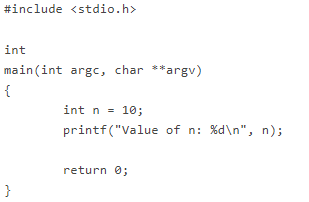
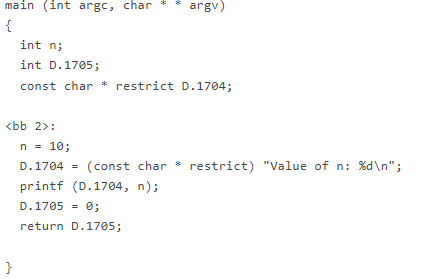
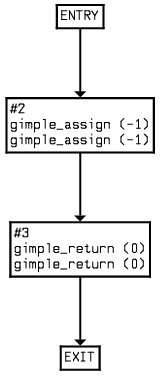

## Procedure

Steps for conducting the experiment

#### **General Instructions**

Follow are the steps to be followed in general to perform the experiments in **Software Engineering Virtual Lab.**

1. Read the theory about the experiment
2. View the simulation provided for a chosen, related problem
3. Take the self evaluation to judge your understanding (optional, but recommended)
4. Solve the given list of exercises

#### **Experiment Specific Instructions**
Following are the instructions specifically for this experiment:

#### **Generating Control Flow Graph with gcc**

1. As an example, consider the following simple C program:

 Figure-01

 2. The basic blocks of the above program.

;; Function main (main)

Merging blocks 2 and 3

 Figure-02

3. The following image shows a graphical representation of the above:. 

 Figure-03

Following are the steps to work on the exercises for this experiment:

- The basic blocks is displayed on clicking the "Show Program Representation" button. 
- Next click on the "Show Contro FLow Graph" button to display a graphical representation of the above program. 
- To determine the McCabe's Cyclomatic Complexity, enter numeric values in the below fields.
- To verify your solution, click on the "Click to view solution" button below the problem statement. This would move you to the bottom of the page. Next click on the View Solution" button to display the solution.

**NOTE:** This experiment is restricted to a given C program, a graph for each such function would be generated. Here we have restricted to the main function only. While we note that in real life one has to consider all the sub modules, our objective here is to make the students familiar with the concept of basic blocks and cyclomatic complexity.