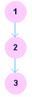
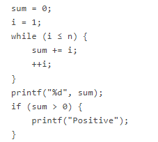
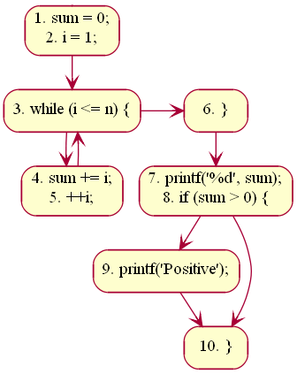
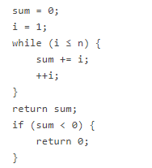
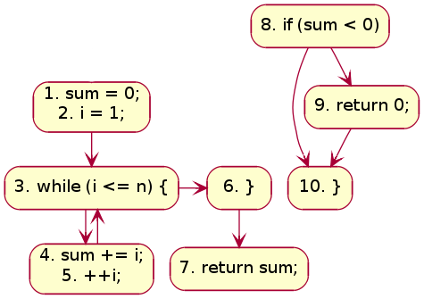

## Introduction 

A visual representation of flow of control within a program may help the developer to perform static analysis of his code. One could break down his program into multiple basic blocks, and connect them with directed edges to draw a Control Flow Graph (CFG). A CFG of a program helps in identifying how complex a program is. It also helps to estimate the maximum number of test cases one might require to test the code.

In this experiment, we will learn about basic blocks and how to draw a CFG using them. We would look into paths and linearly independent paths in context of a CFG. Finally, we would learn about McCabe's cyclomatic complexity, and classify a given program based on that.

## Theory

### Control Flow Graph

A control flow graph (CFG) is a directed graph where the nodes represent different instructions of a program, and the edges define the sequence of execution of such instructions. Figure 1 shows a small snippet of code (compute the square of an integer) along with it's CFG. For simplicity, each node in the CFG has been labeled with the line numbers of the program containing the instructions. A directed edge from node #1 to node #2 in figure 1 implies that after execution of the first statement, the control of execution is transferred to the second instruction.

 Figure-01: A simple program and it's CFG

A program, however, doesn't always consist of only sequential statements. There could be branching and looping involved in it as well. Figure 2 shows how a CFG would look like if there are sequential, selection and iteration kind of statements in order.

 Figure-02: CFG for different types of statements

A real life application seldom could be written in a few lines. In fact, it might consist of thousand of lines. A CFG for such a program is likely to become very large, and it would contain mostly straight-line connections. To simplify such a graph different sequential statements could be grouped together to form a **basic block**. A basic block is a [ii, iii] maximal sequence of program instructions I1, I2, ..., In such that for any two adjacent instructions Ik and Ik+1, the following holds true:

- Ik is executed immediately before Ik+1
- Ik+1 is executed immediately after Ik

The size of a CFG could be reduced by representing each basic block with a node. To illustrate this, let's consider the following example.

 Figure-03

The CFG with basic blocks is shown for the above code in figure 4.

 Figure-04: Basic blocks in a CFG

The first statement of a basic block is termed as **leader**. Any node x in a CFG is said to dominate another node y (written as x dom y) if all possible execution paths that goes through node y must pass through node x. The node x is said to be a **dominator**. In the above example, line #s 1, 3, 4, 6, 7, 9, 10 are leaders. The node containing lines 7, 8 dominate the node containing line # 10. The block containing line #s 1, 2 is said to be the entry block; the block containing line # 10 is said to be the exit block.

If any block (or sub-graph) in a CFG is not connected with the sub-graph containing the entry block, that signifies the concerned block contains code, which is unreachable while the program is executed. Such unreachable code can be safely removed from the program. To illustrate this, let's consider a modified version of our previous code:

 Figure-05

Figure 6 shows the corresponding CFG. The sub-graph containing line #s 8, 9, 10 is disconnected from the graph containing the entry block. The code in the disconnected sub-graph would never get executed, and, therefore, could be discarded.

 Figure-06: CFG with unreachable blocks

### Terminologies
#### **Path**
A path in a CFG is a sequence of nodes and edges that starts from the initial node (or entry block) and ends at the terminal node. The CFG of a program could have more than one terminal nodes.

#### **Linearly Independent Path**
A linearly independent path is any path in the CFG of a program such that it includes at least one new edge not present in any other linearly independent path. A set of linearly independent paths give a clear picture of all possible paths that a program can take during it's execution. Therefore, path-coverage testing of a program would suffice by considering only the linearly independent paths.
In figure 3 we can find four linearly independent paths:

1 - 3 - 6 - (7, 8) - 10

1 - 3 - 6 - (7, 8) - 9 - 10

1 - 3 - (4, 5) - 6 - (7, 8) - 10

1 - 3 - (4, 5) - 6 - (7, 8) - 9 - 10

Note that 1 - 3 - (4, 5) - 3 - (4, 5) - 6 - (7, 8) - 10, for instance, won't qualify as a linearly independent path because there is no new edge not already present in any of the above four linearly independent paths.

### McCabe's Cyclomatic Complexity

McCabe had applied graph-theoretic analysis to determine the complexity of a program module [vi]. Cyclomatic complexity metric, as proposed by McCabe, provides an upper bound for the number of linearly independent paths that could exist through a given program module. Complexity of a module increases as the number of such paths in the module increase. Thus, if Cyclomatic complexity of any program module is 7, there could be up to seven linearly independent paths in the module. For a complete testing, each of those possible paths should be tested.

### Computing Cyclomatic Complexity
Let G be a a given CFG. Let E denote the number of edges, and N denote the number of nodes. Let V(G) denote the Cyclomatic complexity for the CFG. V(G) can be obtained in either of the following three ways:

- Method #1:
V(G) = E - N + 2
- Method #2: V(G) could be directly computed by a visual inspection of the CFG:
V(G) = Total number of bounded areas + 1
It may be noted here that structured programming would always lead to a planar CFG.
- Method #3: If LN be the total number of loops and decision statements in a program, then
V(G) = LN + 1
In case of object-oriented programming, the above equations apply to methods of a class . Also, the value of V(G) so obtained is incremented by 1 considering the entry point of the method. A quick summary of how different types of statements affect V(G) could be found in . Once the complexities of individual modules of a program are known, complexity of the program (or class) could be determined by:

V(G) = SUM( V(Gi) ) - COUNT( V(Gi) ) + 1

where COUNT( V(Gi) ) gives the total number of procedures (methods) in the program (class).

### Optimum Value of Cyclomatic Complexity

A set of threshold values for Cyclomatic complexity has been presented in , which we reproduce below.

V(G) |	Module Category	| Risk
:--|:--|:--|
1-10 |Simple	|Low
11-20 | More complex |	Moderate
21-50|	Complex	| High
\> 50|Unstable	|Very high

It has been suggested that the Cyclomatic complexity of any module should not exceed 10 [vi], [4]. Doing so would make a module difficult to understand for humans. If any module is found to have Cyclomatic complexity greater than 10, the module should be considered for redesign. Note that, a high value of V(G) is possible for a given module if it contains multiple cases in C like switch-case statements. McCabe had exempted such modules from the limit of V(G) as 10 [vi].

#### Merits
McCabe's Cyclomatic complexity has certain advantages:

- Independent of programming language
- Helps in risk analysis during development or maintenance phase
- Gives an idea about the maximum number of test cases to be executed (hence, the required effort) for a given module

### Demerits
Cyclomatic complexity doesn't reflect on cohesion and coupling of modules.

McCabe's Cyclomatic complexity was originally proposed for procedural languages. One may look in  to get an idea of how the complexity calculation could be modified for object-oriented languages. In fact, one may also wish to make use of Chidamber-Kemerer metrics  (or any other similar metric), which has been designed for object-oriented programming.

